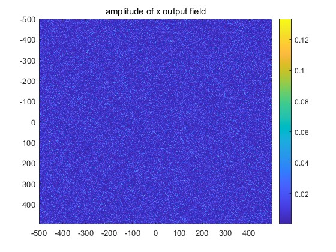

# Vector-Angular-Spectrum-Model-for-light-travelling-in-scattering-medium
The vector angular spectrum can be used to simulate the transport and evolution of a vector light field through a scattering medium.  
One can modify different scattering medium parameters and simulation conditions in the VAS.m file.

Step for a simulation:  
1. Release all .m files in a same folder;
2. Modify the parameters and simulation conditions in VAS.m;
3. Run VAS.m and we can get the following two figures with default settings:

    

Files:  
VAS.m: Main program of the VAS model, one can tune the parameters of the scattering medium or simulation in this file.  
r_cal.m: Calculating the polarization transformation ratio.  
mie_cal.m: Calculating various parameters of the scattering medium based on Mie theory.  
Mie.m, Mie_abcd.m, Mie_pt.m, Mie_S12.m: A package for Mie calculation created by Christian Maetzler in 2002, based on the appendix in Bohren and Huffman (1982).  
